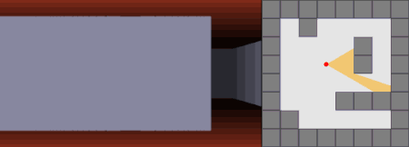
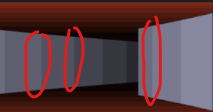
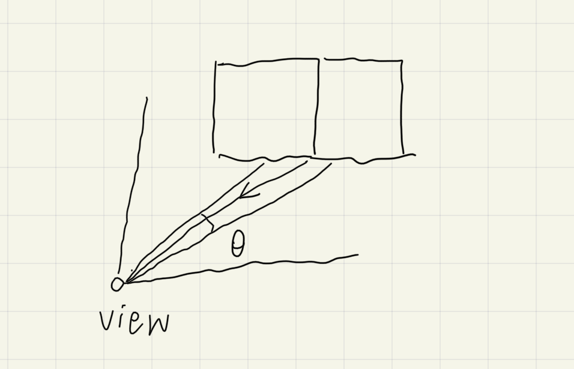
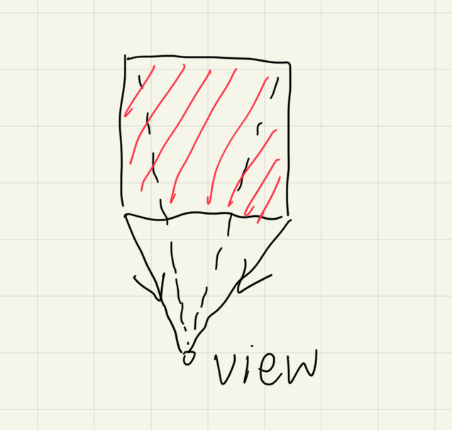
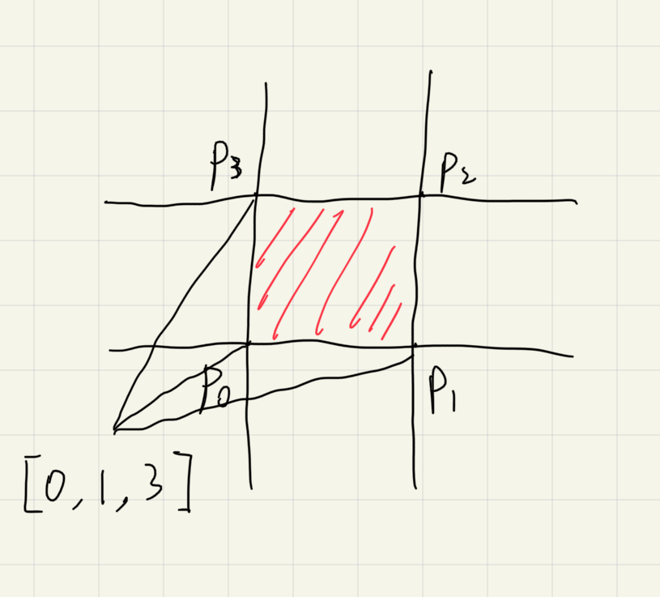
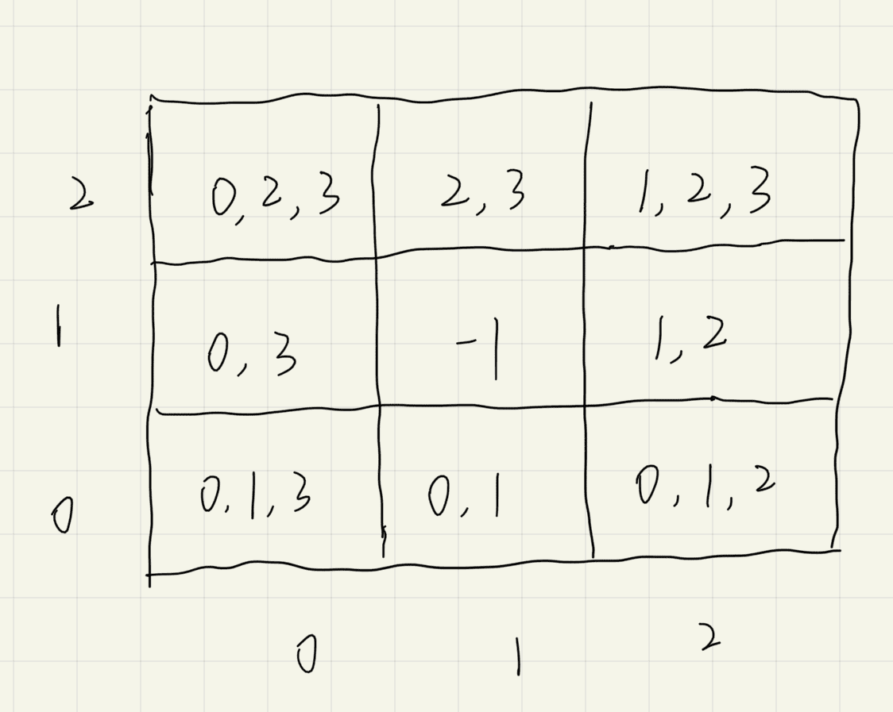

# 光线是否 hit 墙的边界

## 问题

### 要求

渲染中突显墙的边界

相当于墙的边界到人的视野的光线需要特殊处理. 一般的, 边界是某个角度范围

在这个$\theta$范围内的光线都进行特殊的 shade 处理

## 解决

!> 墙有的边角是看不见的, 需要判定

问题的核心是哪些边角是可见的. 这和视点与墙的关系有关, 依据墙划分九个区域, 进行分类讨论

|                划分                 |                结果                 |
| :---------------------------------: | :---------------------------------: |
|  |  |

> 采用的是笛卡尔坐标系讨论

## 实现

如何规范地描述

!> 需要注意的是坐标系的转化

将 view 与 wall 的比较关系映射为`[0, 1, 2]`
