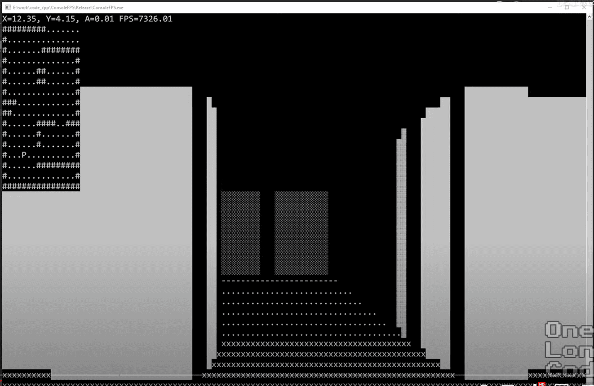

# 游戏主体逻辑

## preview

## 控制帧率

- [Check FPS in JS? [closed]](https://stackoverflow.com/questions/4787431/check-fps-in-js)

## 键盘控制

- [How to take keyboard input in JavaScript?](https://stackoverflow.com/questions/4416505/how-to-take-keyboard-input-in-javascript)

## terminal

- [How to create interactive terminal like website with JavaScript?](https://itnext.io/how-to-create-interactive-terminal-like-website-888bb0972288)

  [JavaScript Terminal](https://terminal.jcubic.pl/)

## character

- ASCII Table:https://www.asciitable.com/

## reference

- Wolfenstein 3D. (2022, November 8). In Wikipedia. https://en.wikipedia.org/wiki/Wolfenstein_3D
