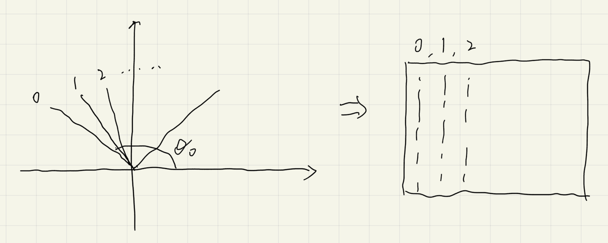

# 游戏主体逻辑

## preview


## 控制帧率

- [Check FPS in JS? [closed]](https://stackoverflow.com/questions/4787431/check-fps-in-js)

- terminal 自带帧率控制

## 键盘控制

- [How to take keyboard input in JavaScript?](https://stackoverflow.com/questions/4416505/how-to-take-keyboard-input-in-javascript)

## terminal

- [How to create interactive terminal like website with JavaScript?](https://itnext.io/how-to-create-interactive-terminal-like-website-888bb0972288)

  [JavaScript Terminal](https://terminal.jcubic.pl/)

## character

- ASCII Table:https://www.asciitable.com/

## 设置字体

!> 设置字体很重要

```css
.terminal {
  --font: Consolas;
}
```

## 模型

- `#` 代表 1X1 的墙体

  墙体的高度为 screen height

- player 的视野高度为 $\frac{1}{2}$ screen height

## 细节

- 数组的申请

  ```js
  let arr = new Array(height);
  for (let i = 0; i < height; i++) {
    arr[i] = new Array(width);
  }
  ```

  容易将 width 和 height 搞反

- 坐标访问

  ```js
  arr[y][x];
  ```

  容易将 x 和 y 搞反

### 坐标系的变换

- Cartesian 转 screen

  ```js
  return [x, height - 1 - y];
  ```

  !> 由于数组的愿意, 注意是`height - 1`

- 人显示在 map 上需要的是 map 的 height 进行转化而不是 screen 的 height

  ```js
  return [x, mapHeight - 1 - y];
  ```

- 光线扫描的顺序

  

  $$\theta_0 = PlayDir + \frac{1}{2}FOV$$

  为了从左往右扫描, 显示图像, 则:

  $$\theta_i = \theta_0 - \frac{i}{N}FOV$$

### 天花板的计算


说明墙的高度设置为 screenHeight

## 改进

- [x] 把输入的"w" "a" "s" "d" 吃掉, 不显示出来

## reference

- Wolfenstein 3D. (2022, November 8). In Wikipedia. https://en.wikipedia.org/wiki/Wolfenstein_3D
